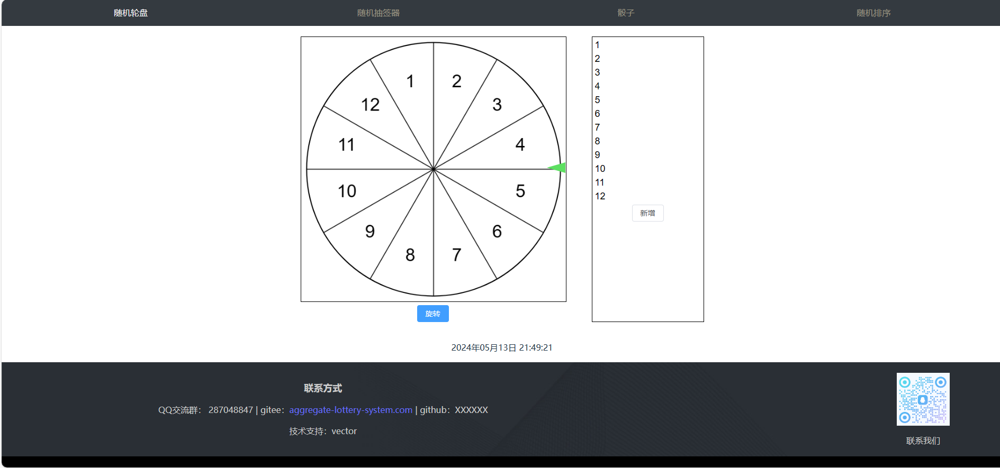
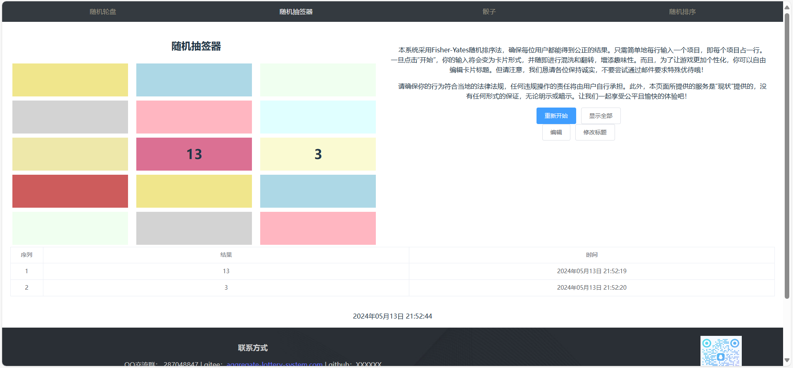
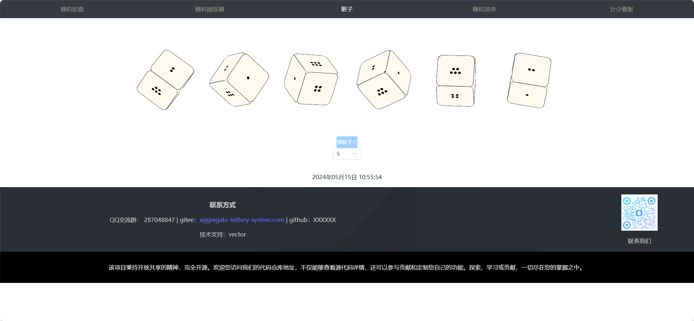
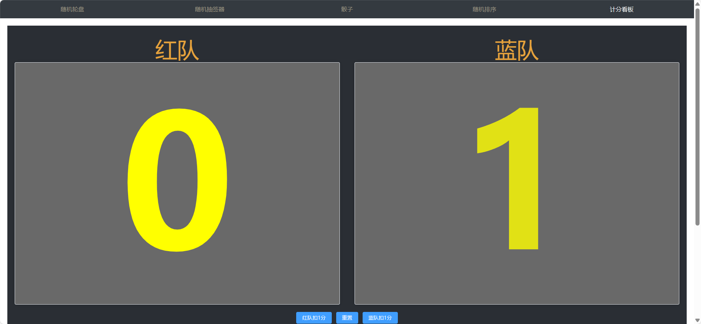
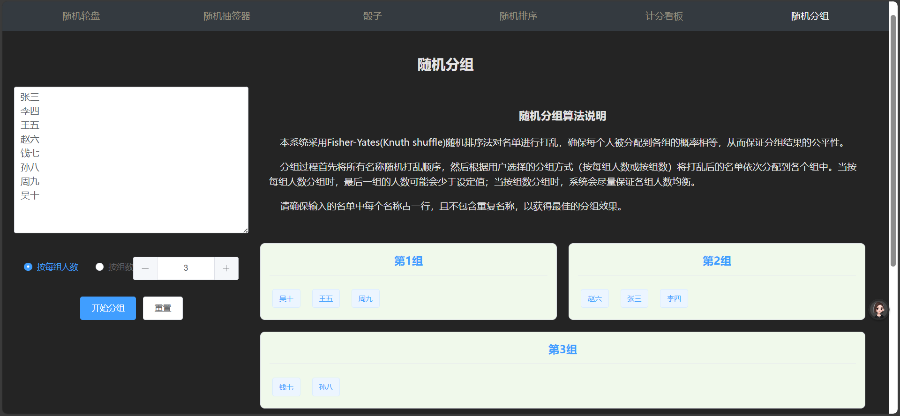

# 聚合抽签系统
聚合随机抽签 v1.0
这个项目旨在帮助用户在抽签时，能够快速、准确地获取抽签结果，适用于团建、会议等场景。最重要的是他是开源的，您可以基于本项目进行二次开发，实现自己的抽签系统。！
技术架构主要为： node18.0.0+,vue3,vite,typescript,element-plus,canvas,vue-router

gitee：<a href="https://gitee.com/WangJiaHui202144/aggregate-lottery-system">aggregate-lottery-system.com</a>
github：<a href="https://github.com/YuanJie2001/Aggregate-lottery-system">aggregate-lottery-system.com</a>
# 一.随机轮盘

# 二.随机抽签器

# 三.骰子

# 四.随机排序

# 五.记分板

# 六.随机分组
